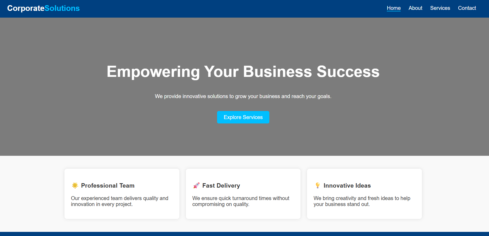
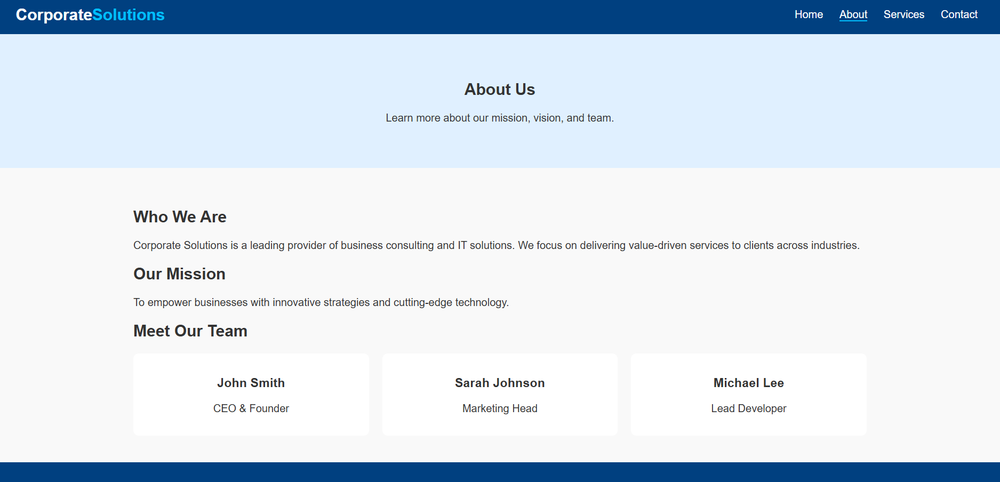
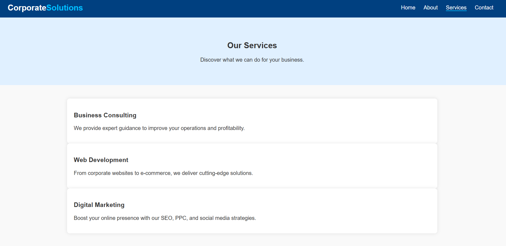
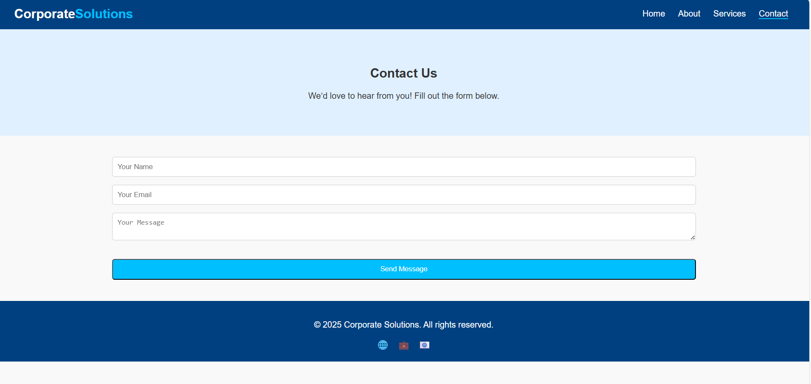

# 🏢 Corporate Solutions Website

A clean, modern, and fully responsive corporate website designed to showcase business services, team, and contact information with a professional look and feel.

## 🌟 Features

✅ Responsive layout for desktop, tablet, and mobile devices

✅ Clean navigation with active link highlighting

✅ Hero banner with call-to-action button

✅ Services section with feature cards

✅ About page with company story and team profiles

✅ Contact page with form validation

✅ Scroll-to-top button for easy navigation

✅ Smooth page transitions and animations

✅ Simple, customizable design with reusable CSS and JS

## 🛠 Tech Stack

**Frontend:**
- HTML5
- CSS3 (Flexbox & Grid)
- JavaScript (Vanilla)

**Backend:**
- None (static frontend project)

## 📜 Pages

1️⃣ **Home Page** – Introduction with hero banner and key features.

2️⃣ **About Us Page** – Company mission, vision, and team members.

3️⃣ **Services Page** – Detailed overview of business services.

4️⃣ **Contact Page** – Contact form with validation and social links.

## 👨‍💻 Team Member
| Name           | Role               |
|----------------|--------------------|
| Ahmed Faiza    | Devloper           |

## 📌 Setup & Installation

1️⃣ Download or clone the repository to your local machine.

2️⃣ Open the project folder in your preferred code editor.

3️⃣ Open `index.html` in any modern web browser to view the website.

4️⃣ Navigate through pages using the menu bar.

## 📅 Development Roadmap

🟢 **Phase 1** – Build responsive multi-page layout with core content.

🟡 **Phase 2** – Add interactive JavaScript features (form validation, scroll-to-top).

🔵 **Phase 3** – Improve UI with animations and transitions.

🟣 **Phase 4** – Optimize for performance and cross-browser compatibility.

### Home Page

### About Us Page

### Services Page

### Contact Us Page

## 🚀 Future Enhancements

- 🔹 Add a backend with CMS integration for dynamic content management.  
- 🔹 Implement user login and personalized dashboards.  
- 🔹 Integrate a blog or news section for company updates.  
- 🔹 Add multi-language support for global reach.   
- 🔹 Add advanced analytics and SEO optimization.  
- 🔹 Include live chat support feature.  

---

🎯 **Delivering excellence in corporate web presence!**
